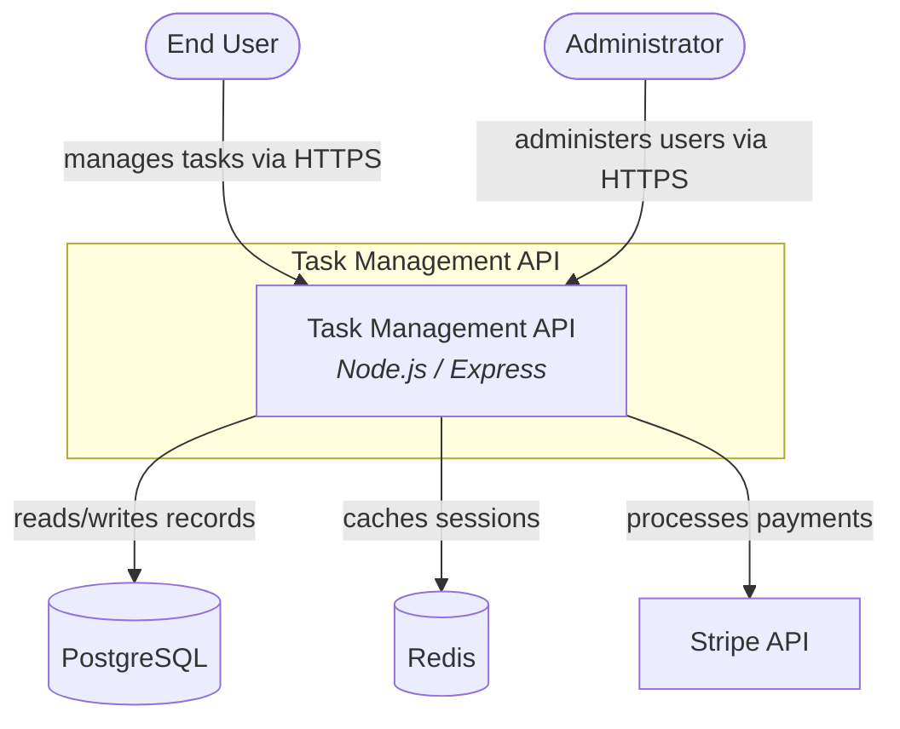

## Purpose

The System Context diagram is the C4 Level 1 view. It answers: **who uses this
system, and what external systems does it depend on?**

The system itself is a single box inside a boundary subgraph. People (users,
admins, operators) and external systems (databases, APIs, queues) surround it.
Labeled edges show what each relationship does. A new engineer should glance at
this diagram and immediately know the system's place in its ecosystem.

---

## Mapping Rules

1. **Node IDs.** Convert each entity's `id` from kebab-case to
   UPPER_SNAKE_CASE. `stripe-api` becomes `STRIPE_API`. `end-user` becomes
   `END_USER`. Mermaid flowchart node IDs cannot contain hyphens.

2. **The system node.** Place the `system` entity inside a subgraph boundary.
   Use the system's `name` as the subgraph label. The node gets a technology
   annotation in italics:
   ```
   subgraph boundary [System Name]
       SYSTEM_ID[System Name<br/><i>Technology</i>]
   end
   ```

3. **People nodes.** Each entry in `people` becomes a node with stadium
   (rounded) shape:
   ```
   END_USER([End User])
   ```

4. **External system nodes.** Each entry in `external_systems` gets a shape
   based on its nature:
   - Databases and caches (PostgreSQL, Redis, MongoDB, MySQL, DynamoDB,
     Elasticsearch, or any entity whose `technology` or `name` suggests a
     data store): cylinder shape `[(Name)]`
   - Everything else (APIs, services, queues): rectangle `[Name]`

   Include technology annotation when the entity has a `technology` field:
   ```
   STRIPE_API[Stripe API<br/><i>HTTPS</i>]
   ```

5. **Edges.** Each entry in `relationships` becomes a labeled edge:
   ```
   SOURCE_ID -->|description| TARGET_ID
   ```
   Use the `description` field as the label. If `description` includes the
   protocol, use it as-is. If not and `technology` exists, append it.

6. **Node limit enforcement.** Count all nodes (system + people +
   external_systems). If over 12, keep the system node and the nodes that
   appear most frequently in `relationships` (count source + target
   appearances). Log which entities were omitted.

---

## Node ID Convention

Convert `id` from kebab-case to UPPER_SNAKE_CASE:
- `stripe-api` → `STRIPE_API`
- `end-user` → `END_USER`
- `task-api` → `TASK_API`

Mermaid flowchart node IDs cannot contain hyphens — they break parsing.

---

## Shape Convention

| Entity Type | Shape | Example |
|-------------|-------|---------|
| System (inside boundary) | Rectangle with tech | `TASK_API[Task Management API<br/><i>Node.js / Express</i>]` |
| Person | Stadium (rounded) | `END_USER([End User])` |
| External system (data store) | Cylinder | `POSTGRESQL[(PostgreSQL)]` |
| External system (other) | Rectangle | `STRIPE_API[Stripe API]` |

Data stores are identified by `technology` or `name` containing: PostgreSQL,
MySQL, MongoDB, Redis, DynamoDB, Elasticsearch, SQLite, Cassandra, Memcached.
When in doubt, use rectangle.

---

## Example Transformation

**Input** (`.archeia/codebase/architecture/system.json`):

```json
{
  "system": {
    "id": "task-api",
    "name": "Task Management API",
    "technology": "Node.js / Express"
  },
  "people": [
    { "id": "end-user", "name": "End User" },
    { "id": "admin", "name": "Administrator" }
  ],
  "external_systems": [
    { "id": "postgresql", "name": "PostgreSQL", "technology": "PostgreSQL 15" },
    { "id": "redis", "name": "Redis", "technology": "Redis 7" },
    { "id": "stripe-api", "name": "Stripe API", "technology": "HTTPS" }
  ],
  "relationships": [
    { "source": "end-user", "target": "task-api", "description": "manages tasks via HTTPS" },
    { "source": "admin", "target": "task-api", "description": "administers users via HTTPS" },
    { "source": "task-api", "target": "postgresql", "description": "reads/writes records" },
    { "source": "task-api", "target": "redis", "description": "caches sessions" },
    { "source": "task-api", "target": "stripe-api", "description": "processes payments" }
  ]
}
```

**Output** (`.archeia/codebase/diagrams/context.md`):

````markdown
# System Context



**Source:** `.archeia/codebase/architecture/system.json`
**Generated:** 2025-01-15
````

---

## Quality Rubric

- **TRACEABILITY:** Every node traces to an entity `id` in System.json. Every
  edge traces to an entry in `relationships`. No invented nodes or edges.
- **COMPLETENESS:** All entities from System.json appear as nodes (up to the
  12-node limit). All relationships appear as edges. The system boundary
  subgraph is present with the system node inside.
- **LABELING:** Every edge has a label from the source `description` field.
  The system node has a technology annotation in italics. External systems
  with a `technology` field show the annotation.
- **LIMITS:** Total node count does not exceed 12. When trimming, the system
  node is always kept; remaining nodes are ranked by number of relationship
  appearances (source + target).

---

## Anti-Patterns

- **Inventing a "Load Balancer" or "CDN" node** because most systems have
  one. If it's not in System.json, it's not in the diagram.
- **Using `C4Context` Mermaid type** instead of `flowchart TB`. The C4 types
  are experimental and render inconsistently.
- **Omitting the system boundary subgraph.** The boundary distinguishes the
  system from its environment — it's the core visual structure.
- **Unlabeled edges.** An arrow from User to System with no label could mean
  anything. Always use the `description` from relationships.
- **Exceeding 12 nodes.** A system context with 20 nodes is unreadable. Trim
  to the limit and log omissions.
