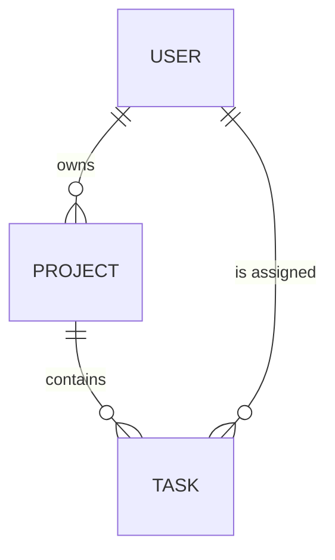

## Purpose

The Entity-Relationship diagram answers: **what are the core data entities
and how do they relate?**

It renders the domain data model from Entities.json as a visual ER diagram.
Focus is on primary entities and their direct relationships — not join tables,
audit logs, or migration-tracking tables. The diagram shows cardinality
(one-to-one, one-to-many, many-to-many) and relationship labels.

---

## Mapping Rules

1. **Entity names.** Convert each entity's `id` to UPPER_SNAKE_CASE for the
   Mermaid entity name. `user` becomes `USER`. `limit-order` becomes
   `LIMIT_ORDER`. Mermaid ERD entity names cannot contain hyphens.

2. **Relationships.** Each entry in `relationships` becomes a line with
   cardinality symbols and the `description` field as the label:
   ```
   USER ||--o{ PROJECT : "owns"
   ```

   Map `cardinality` values to Mermaid symbols:
   - `one_to_one` → `||--||`
   - `one_to_many` → `||--o{`
   - `many_to_many` → `}o--o{`

3. **Entity limit enforcement.** If more than 12 entities exist, include the
   ones that appear in the most relationships (count source + target
   appearances). Log which entities were omitted.

---

## Entity ID Convention

Convert `id` to UPPER_SNAKE_CASE:
- `user` → `USER`
- `limit-order` → `LIMIT_ORDER`
- `order-book` → `ORDER_BOOK`

Mermaid ERD entity names cannot contain hyphens.

---

## Cardinality Convention

| JSON Value | Mermaid Symbol | Meaning | Example |
|------------|---------------|---------|---------|
| `one_to_one` | `\|\|--\|\|` | Exactly one on each side | `USER \|\|--\|\| PROFILE : "has"` |
| `one_to_many` | `\|\|--o{` | One on left, many on right | `USER \|\|--o{ TASK : "creates"` |
| `many_to_many` | `}o--o{` | Many on each side | `TAG }o--o{ TASK : "labels"` |

The source entity from the JSON goes on the left. The target goes on the right.

---

## Example Transformation

**Input** (`.archeia/codebase/architecture/entities.json`):

```json
{
  "entities": [
    { "id": "user", "name": "User" },
    { "id": "project", "name": "Project" },
    { "id": "task", "name": "Task" }
  ],
  "relationships": [
    { "source": "user", "target": "project", "cardinality": "one_to_many", "description": "owns" },
    { "source": "project", "target": "task", "cardinality": "one_to_many", "description": "contains" },
    { "source": "user", "target": "task", "cardinality": "one_to_many", "description": "is assigned" }
  ]
}
```

**Output** (`.archeia/codebase/diagrams/erd.md`):

````markdown
# Entity-Relationship Diagram



**Source:** `.archeia/codebase/architecture/entities.json`
**Generated:** 2025-01-15
````

---

## Quality Rubric

- **TRACEABILITY:** Every entity name traces to an entity `id` in
  Entities.json. Every relationship line traces to an entry in
  `relationships`. No invented entities or relationships.
- **COMPLETENESS:** All entities from Entities.json appear (up to the 12-entity
  limit). All relationships between included entities appear.
- **LABELING:** Every relationship line has a label from the `description`
  field, quoted in the Mermaid syntax. Cardinality symbols correctly map from
  the `cardinality` field.
- **LIMITS:** Total entity count does not exceed 12. When trimming, keep
  entities that appear in the most relationships.

---

## Anti-Patterns

- **Including join tables or audit logs.** Entities.json should only contain
  domain entities — but if it does contain non-domain entries, do not invent
  a filtering step. Render what the JSON contains.
- **Using wrong cardinality symbols.** `one_to_many` is `||--o{`, not
  `||--||`. Double-check the mapping table.
- **Exceeding 12 entities.** Large ERDs become spaghetti. Trim and log.
- **Omitting relationship labels.** Every line needs a quoted label from
  `description`. Unlabeled relationships are ambiguous.
