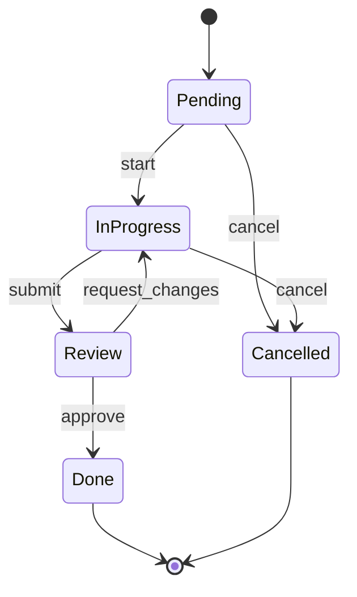

## Purpose

The State Lifecycle diagram answers: **what are the valid states of an entity
and how does it transition between them?**

It renders state machines from StateMachine.json as visual state diagrams — one
diagram per stateful entity. Each diagram shows the states an entity can be in,
the transitions between them (with trigger labels), and the entry/exit points.
A developer should see at a glance which transitions are valid and which states
are terminal.

---

## Mapping Rules

1. **State names.** Convert `snake_case` state names to `PascalCase` for
   readability. `in_progress` becomes `InProgress`. `pending` becomes
   `Pending`. `done` becomes `Done`.

2. **Initial state.** The `initial_state` field gets an entry transition from
   the Mermaid start marker:
   ```
   [*] --> Pending
   ```

3. **Transitions.** Each entry in `transitions` becomes a labeled arrow:
   ```
   Source --> Target : trigger
   ```
   Use the `trigger` field as the label.

4. **Terminal states.** Each state listed in `terminal_states` gets an exit
   transition to the Mermaid end marker:
   ```
   Done --> [*]
   Cancelled --> [*]
   ```

5. **State limit enforcement.** If more than 10 states exist, include the
   states that participate in the most transitions (count source + target
   appearances). Always keep the initial state and terminal states. Log
   omissions.

---

## State Name Convention

Convert `snake_case` to `PascalCase`:
- `pending` → `Pending`
- `in_progress` → `InProgress`
- `request_changes` → `RequestChanges`
- `done` → `Done`

This convention makes state names visually distinct from transition triggers
(which remain lowercase).

---

## Output Naming

One file per state machine. Name the file using the `entity` field from each
state machine entry:
- `state-task.md`
- `state-order.md`
- `state-question.md`

The heading uses the `entity_name` field: `# State Lifecycle — Task`.

---

## Example Transformation

**Input** (`.archeia/codebase/architecture/statemachine.json`, one state machine):

```json
{
  "state_machines": [
    {
      "id": "task-lifecycle",
      "entity": "task",
      "entity_name": "Task",
      "initial_state": "pending",
      "terminal_states": ["done", "cancelled"],
      "states": [
        { "name": "pending" },
        { "name": "in_progress" },
        { "name": "review" },
        { "name": "done" },
        { "name": "cancelled" }
      ],
      "transitions": [
        { "source": "pending", "target": "in_progress", "trigger": "start" },
        { "source": "in_progress", "target": "review", "trigger": "submit" },
        { "source": "review", "target": "in_progress", "trigger": "request_changes" },
        { "source": "review", "target": "done", "trigger": "approve" },
        { "source": "pending", "target": "cancelled", "trigger": "cancel" },
        { "source": "in_progress", "target": "cancelled", "trigger": "cancel" }
      ]
    }
  ]
}
```

**Output** (`.archeia/codebase/diagrams/state-task.md`):

````markdown
# State Lifecycle — Task



**Source:** `.archeia/codebase/architecture/statemachine.json` (entity: task)
**Generated:** 2025-01-15
````

---

## Quality Rubric

- **TRACEABILITY:** Every state traces to an entry in the state machine's
  `states` array. Every transition traces to an entry in `transitions`. No
  invented states or transitions.
- **COMPLETENESS:** All states appear (up to the 10-state limit). All
  transitions between included states appear. The initial state has a `[*] -->`
  entry. Terminal states have `--> [*]` exits.
- **LABELING:** Every transition has a label from the `trigger` field. State
  names are PascalCase conversions of the JSON state names.
- **LIMITS:** Total state count does not exceed 10. When trimming, always keep
  initial and terminal states; rank remaining by transition participation.

---

## Anti-Patterns

- **Inventing transitions.** If the JSON has 6 transitions, the diagram has 6
  arrows. Do not add inferred transitions.
- **Missing initial/terminal markers.** Every state diagram must have `[*] -->`
  for the initial state and `--> [*]` for each terminal state.
- **Using snake_case state names.** Convert to PascalCase for readability.
  `in_progress` renders as `InProgress`.
- **Exceeding 10 states.** Large state diagrams lose their value. Trim and log.
