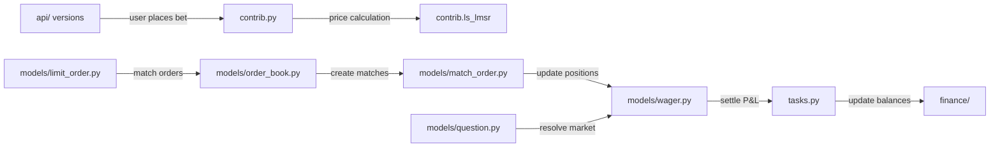

## Purpose

This skill generates colocated READMEs — one per directory that needs one —
so that every significant part of a codebase has human-readable context right
next to the code. It does not generate a root README (that's personal and
project-specific). It generates the interior READMEs that make a codebase
navigable.

Read `references/README_PROTOCOL.md` before starting. It explains the
philosophy behind every decision in this skill: why colocated, what goes in,
what stays out, and how READMEs work in the agentic era alongside `agents.md`.

Read `references/examples.md` for gold-standard examples of the quality bar
this skill must hit. Study them before generating — they show the difference
between generic output and genuinely useful READMEs.

READMEs are the knowledge layer of a directory. They describe, explain,
and accumulate learnings — tried approaches, dead ends, gotchas. They are
for humans AND agents to read. The companion `agents.md` (when it exists)
contains the imperative rules extracted from this knowledge. The README
tells the story; `agents.md` gives the commands. They never overlap.

The most valuable part of a README is the section that can't be generated
from code: accumulated learnings. This section grows over time as agents
and humans work in the directory. When generating a new README, seed this
section. When updating an existing README, never touch it — only append.

Every claim in a generated README must cite evidence from the actual code.

## Workflow

### Phase 1: Read the Scan Report

Read `.archeia/codebase/scan-report.md`. If it doesn't exist, stop and tell the user:
"Run archeia:scan-repo first — this skill needs the scan report to know which
directories need READMEs."

Find the **README Coverage** section. It contains a table:

```
| Directory | Source Files | Has README |
|-----------|-------------|------------|
```

And a summary line: **X of Y directories need READMEs**.

Parse this table. Every row is a directory to process. Skip the root directory
(`./` or the repo name) — this skill does not generate root READMEs.

### Phase 2: Gather Context

Before generating any READMEs, build context:

1. Read `.archeia/codebase/architecture/architecture.md` if it exists — for module boundaries,
   topology, and system overview. This tells you what role each directory
   plays in the larger system.

2. Read `.archeia/codebase/standards/standards.md` if it exists — for naming conventions and
   patterns. This helps you describe key concepts accurately.

3. Read `.archeia/codebase/guide.md` if it exists — for commands and workflows. If a
   directory has its own dev commands, you'll reference Guide.md rather than
   duplicating them.

If `.archeia/` docs don't exist, you can still generate READMEs — just rely
on direct code inspection instead.

**File reading budget:** Expect to read 3–5 source files per directory to
write a good README. For a repo with 20 directories, that's 60–100 file reads.
This is intentional — the quality of a README is directly proportional to how
much source code you actually read. Skimming directory listings produces
generic output. Reading models, services, and logic files produces useful
output.

### Phase 3: Generate or Update Each README

For each directory from the coverage table (excluding root):

**Step 1 — Deeply inspect the directory.** This is the most important step.
You cannot write a good README from directory listings alone. You must read
actual source code to understand what this module does in domain terms.

For each directory:
- List its contents (files, subdirectories)
- Read the existing README.md if one exists
- Read **at least 3–5 source files**: models, services, views, handlers,
  tasks, or whatever the core logic files are. Read the actual code — not just
  file names. You need to understand:
  - What **domain concepts** this module implements (e.g., "prediction market
    order matching", not "Django models")
  - What **data flows** through it (e.g., "user places a wager → position
    created → market price updated", not "tasks.py runs background work")
  - What **external systems** it talks to (e.g., "Stripe for payments, Skrill
    for withdrawals", not "external integrations")
  - What **non-obvious patterns** exist (e.g., "all currency amounts use
    moneyed Money objects, never raw floats")
- Grep for imports of this module across the codebase to understand how other
  parts depend on it and what specific functions/classes they use

This step is what separates useful READMEs from generic ones. A README that
says "Contains the `wager` package" has failed. A README that says "Implements
prediction market wagering — position creation, order matching, and settlement
logic for binary and multi-outcome markets" has succeeded.

**Step 2 — Decide: create or update.**

- **No README exists** → create one from the template below.
- **README exists** → read it, then update: add the template sections (with
  mermaid diagram) **below** the existing content, preserving everything the
  human wrote. Never delete or overwrite paragraphs that a human wrote. If a
  section seems outdated, leave it and add an
  `<!-- REVIEW: this section may be outdated -->` comment above it.

**Step 3 — Write the README** following the template.

### README Template

Every generated subdirectory README follows this structure. Aim for **40 lines
maximum** excluding mermaid diagram content.

---

#### Title and Purpose

**Always include.** The directory name as a heading, followed by 1–2 sentences
explaining what this directory does **in domain-specific terms**. The reader
should immediately understand the business or technical purpose, not just that
"this directory contains code."

**Good:**
```markdown
# account

User identity, authentication, KYC verification, and financial account
management for the Futuur prediction market. Handles user registration
(email, social, web3/Privy), OAuth2 token issuance with 2FA, withdrawal
requests across multiple payment gateways, and user summary aggregation.
```

**Bad:**
```markdown
# account

Contains the `account` package. Most of the code is organized under `admin/`,
`management/`, `migrations/`, `models/` and runtime modules like `tasks.py`,
`views.py`.
```

The bad example just restates the directory listing. It tells you nothing about
what accounts do: identity, auth, KYC, payment gateways. The good example
tells you the full scope — registration methods, 2FA, withdrawal flows,
analytics aggregation — so you immediately know this isn't just "user CRUD."

Infer from: reading actual model fields, service functions, docstrings, and
how the module is imported elsewhere. Architecture.md module boundaries can
help but are not sufficient — you need the code.

---

#### Structure

**Always include. Always use a mermaid diagram.** The mermaid diagram is the
most valuable part of a README — it shows relationships and data flow that
humans can't quickly extract from reading code. Plain text directory trees are
a fallback only if the directory has 3 or fewer flat entries with no
meaningful relationships between them (rare).

The diagram should show **how things flow**, not just what exists. Arrows
represent data flow, dependency direction, or call patterns — not just "this
directory contains these subdirectories."

**Good — shows domain-specific flow with real class/file names:**

````markdown
## Structure


````

**Bad — just restates the directory listing as a tree:**

```text
wager/
├── admin/ — Django admin registrations
├── management/ — custom management commands
├── migrations/ — schema history for Django models
├── models/ — ORM modules and domain entities
└── contrib.py — cross-app integration helpers
```

The bad example adds no information beyond `ls`. The good example shows you
the actual wager lifecycle: API → pricing via LS-LMSR → order book matching →
position updates → settlement → finance. Edge labels use domain language
("user places bet", "resolve market"). Node labels reference real files
(`contrib.ls_lmsr`, `models/order_book.py`). You'd need 30 minutes of
code-reading to piece this together otherwise.

Rules:
- **Mermaid is the default.** Only fall back to a text tree for trivially flat
  directories
- Show data flow or dependency direction with arrows, not just containment
- Label nodes with **domain-meaningful names** (e.g., `models/Position`, not
  just `models/`)
- Use `graph LR` (left-right) for pipelines and request flows, `graph TD`
  (top-down) for layer hierarchies
- Max 10 nodes — this is an overview
- Every node must correspond to an actual directory, file, or module that
  exists — verify with Glob

---

#### Key Concepts

**Always include.** The 3–5 things someone needs to know before working in
this directory. These must be **specific to this module's domain** — things
you learned from reading the actual source code.

**Good — domain-specific, learned from reading code:**
```markdown
## Key Concepts

- **Question = Market** — `Question` is the central market entity with outcomes,
  scoring rules (basic, LMSR, LS-LMSR), and lifecycle states (draft → open →
  closed → resolved). Supports binary (2 outcomes) and multi-outcome markets.
- **Order book with mirrored orders** — `OrderBook` builds normalized bid/ask
  views. For binary markets, it mirrors orders across outcomes via `1 - price`.
  `LimitOrder` supports limit, market, and mirror order types with maker/taker
  fee structures.
- **Wager as consolidated position** — A `Wager` represents a user's net
  position on one outcome in one currency. States: purchased → sold/win/lost/
  cancelled/disabled. All currency amounts use `djmoney.Money` objects via
  `ExtendedMoneyField`.
- **LS-LMSR pricing** — `contrib.py` delegates to `contrib.ls_lmsr.LsLmsr` for
  price calculations with bounded loss and tax parameters per currency mode
  (play money vs real money).
- **Dual currency modes** — Every market operates in both play money (`OOM`)
  and real money (canonical currency), filtered via `CurrencyModeQuerySet`.
```

**Bad — generic framework descriptions copy-pasted across every README:**
```markdown
## Key Concepts

- **Schema history** — Django migrations in `migrations/` track how the
  persistent model changes over time.
- **Operational entry points** — `management/commands/` contains CLI tasks.
- **Background work** — asynchronous jobs are implemented in `tasks.py`.
```

The bad example describes generic Django patterns that apply to every app in
the repo. A developer already knows what `migrations/` is. What they don't
know is how order matching works, or why you can't use raw floats for currency.

**The test:** if a concept would appear identically in 5+ different module
READMEs, it's too generic. Each README's key concepts should be unique to that
module. Read the actual models, services, and logic files to find them.

---

#### Usage

**Always include.** How other parts of the codebase consume this module.
Not just "imports appear in X" — explain what the integration does.

**Good — explains the integration:**
```markdown
## Usage

The API layer (`api/v1/`, `api/v1_5/`, `api/v2_0/`) imports `wager.models`
for serialization and `wager.contrib` for price calculations. `importer/`
syncs external market data into `Question`/`Outcome` structures.
`notification/` is called on resolution for win/loss emails and push
notifications. `doubleentry/` handles the accounting entries for every wager
transaction. `market_maker/` places automated orders through the order book.
```

**Bad — just lists file names with no context:**
```markdown
## Usage

Imports or references to `wager` appear in `importer/contrib.py`,
`importer/tasks.py`, `importer/serializers.py`.
`apps.py` defines the Django app configuration for `wager`.
```

The bad example tells you where the imports are but not what they do or why.
The good example tells you that the API serializes, the importer syncs
external data, notification alerts on resolution, doubleentry handles
accounting, and market_maker automates orders — now you know what will break
if you change something and which teams to coordinate with.

Infer from: grep for imports of this directory across the codebase, then read
the importing files to understand what they actually use and why.

---

#### Conditional: Local Development

**Include only if** the directory has its own manifest (package.json,
pyproject.toml, etc.) or its own scripts/Makefile.

```markdown
## Local Development

This package has its own dev server. See [Guide.md](../../.archeia/codebase/guide.md)
for full setup, or:

\`\`\`bash
cd packages/billing
pnpm dev
\`\`\`
```

Link to Guide.md for full instructions. Only include the 1–2 most essential
commands here.

---

#### Learnings

**Always include.** Seed with an empty or minimal section when creating a
new README. When updating an existing README, never modify this section —
only append new entries. This section grows organically through work, not
through code analysis.

**Good — specific, actionable learnings from actual work:**
```markdown
## Learnings

- **Async ORM trap** — Tried converting `tasks.py` to async in PR #412.
  The Django ORM blocks the event loop on every query. Reverted. If async
  is needed, it requires a full SQLAlchemy migration. (2024-09-15)
- **Stripe idempotency keys** — Webhook retries arrive with the same
  idempotency key. If you process the event and the response times out,
  Stripe resends it. Every handler must check `StripeEvent.processed`
  before taking action. (2024-10-03)
- **Money precision** — Raw float arithmetic on currency amounts caused
  a $0.01 rounding drift in settlement totals over 10k transactions.
  Always use `djmoney.Money` objects. Never `float()` a Money value.
  (2024-11-20)
```

**Bad — vague, unhelpful, or restating the obvious:**
```markdown
## Learnings

- Be careful with async code
- Make sure to handle errors properly
- The billing module is complex
```

The bad example gives no actionable information. The good example tells you
exactly what was tried, why it failed, and what to do instead — saving
hours of debugging that someone already did.

**Format for each entry:**
- Bold title summarizing the learning
- What was tried and what happened
- What to do instead (or what to avoid)
- Date or PR reference so readers can find more context

**The sacred rule:** never delete, summarize, or "clean up" entries in
this section. Every entry represents work that doesn't need to be
repeated. Append only.

---

### Writing Style

READMEs are knowledge documents — they should read like a knowledgeable
colleague explaining a directory, not like generated documentation.

**Voice and tone:**
- Write in plain, direct prose. No hedging ("this might be," "it seems
  like"). State what the code does with confidence backed by evidence.
- Use domain language, not framework language. "Prediction market order
  matching" not "Django model layer." "KYC verification pipeline" not
  "background task processing."
- Be specific. Name the files, the classes, the functions. "The
  `OrderBook` in `models/order_book.py` mirrors orders across outcomes
  via `1 - price`" not "the order book handles order matching."
- Write for someone who knows programming but doesn't know this codebase.
  Don't explain what Django migrations are. Do explain what this module's
  migrations do differently or why they matter.

**What makes a README useful vs. generic:**
- A useful README teaches you something you can't learn from `ls`. If your
  README could be generated from file names alone, it has failed.
- A useful README uses the actual names from the code. Real model names,
  real function names, real file paths. Not "the data layer" but
  "`models/wager.py` — consolidated position per user per outcome."
- A useful README explains flow, not just structure. Not "contains
  `tasks.py`" but "`tasks.py` runs settlement after market resolution,
  calculating P&L across all positions and updating `doubleentry/`."

**Narrative in the right places:**
- Title & Purpose: concise, factual, domain-specific (1–2 sentences)
- Structure: visual (mermaid), minimal prose
- Key Concepts: explanatory but dense — each bullet teaches one thing
- Usage: describes integrations with enough context to understand what breaks
- Learnings: narrative is encouraged here — tell the story of what happened,
  what was tried, why it failed. This is where voice matters most because
  these entries are lessons, not just facts.

**What to avoid:**
- Filler phrases: "This directory contains," "It is worth noting that,"
  "As mentioned above"
- Framework boilerplate: "Django app with models, views, and templates"
- Passive voice when active is clearer: "Settlement runs nightly" not
  "Settlement is run on a nightly basis"
- Identical sentences across multiple READMEs — if you're writing the same
  thing for 5 directories, it's too generic

---

### Phase 4: Report

After processing all directories, print a summary:

```
README generation complete.

Created: 4
  - src/services/billing/README.md
  - src/services/auth/README.md
  - src/lib/database/README.md
  - src/lib/cache/README.md

Updated: 1
  - src/components/README.md (added Structure and Usage sections)

Skipped (root): 1
  - ./
```

## Quality Rules

- **40-line limit** (excluding mermaid) — if a README is longer, content
  belongs in `.archeia/` docs instead. Link, don't inline.
- **No badges, shields, or decorative elements.**
- **No marketing language** — no "modern", "scalable", "blazing fast",
  "cutting-edge". State what the code does.
- **Evidence-grounded** — every factual claim should be verifiable by reading
  the directory's contents. Do not invent modules, patterns, or abstractions.
- **Link, don't duplicate** — if Guide.md, Standards.md, or `agents.md`
  already covers something, link to it. A README should never repeat setup
  steps, coding conventions, or agent imperative rules. READMEs describe
  and accumulate knowledge; `agents.md` gives commands. They never overlap.
- **Mermaid diagrams must reflect reality** — every node must correspond to an
  actual directory or module. Use Glob to verify.
- **Preserve human content** — when updating, never delete or overwrite
  existing prose. Add missing sections; flag stale ones.
- **Learnings are sacred** — never delete, overwrite, or "clean up" the
  Learnings section. Every entry was written by someone who discovered
  something the hard way. Append only.
- **Domain language over framework language** — "order matching" not
  "model processing." If your README reads like Django/React/Rails docs
  instead of docs about THIS project's domain, rewrite it.

## Anti-Patterns

**The generic README.** The single most common failure mode. Signs:
- Title says "Contains the `X` package" — this restates the directory name
- Key Concepts are identical across 10+ READMEs ("Schema history — Django
  migrations track how the persistent model changes over time")
- Structure is a plain text directory tree that restates `ls`
- Usage says "Imports appear in X, Y, Z" without explaining what or why

If you find yourself writing the same sentence for multiple directories, stop.
That sentence describes a framework pattern, not this module. Delete it and
read more source code until you find something specific.

**Other anti-patterns:**
- `` → use inline mermaid instead
- A 200-line README covering setup, testing, deployment → split across
  Guide.md, Standards.md, CONTRIBUTING.md
- Plain text tree when relationships exist → use mermaid to show flow
- Duplicating test commands from Guide.md → link to Guide.md
- A "Technologies" section listing dependencies → that's in Standards.md
- Deleting human-written content because it wasn't in the template →
  preserve it, add template sections alongside it
- Deleting or summarizing Learnings entries to "keep it clean" →
  every entry represents work someone already did. Keep them all.
- Framework-language READMEs that could describe any Django/React/Rails
  app → rewrite with domain-specific language from the actual code

## Expected Output

One `README.md` per directory identified in the scan report's README Coverage
table (excluding root). Files are written directly into each directory.
